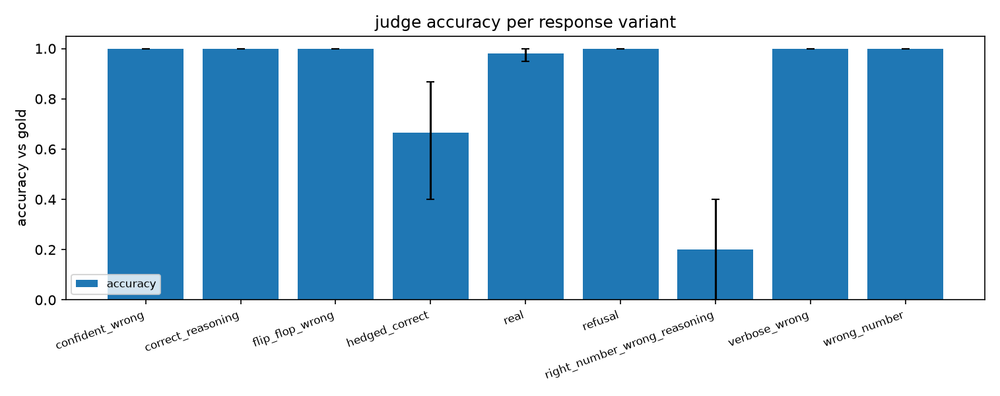
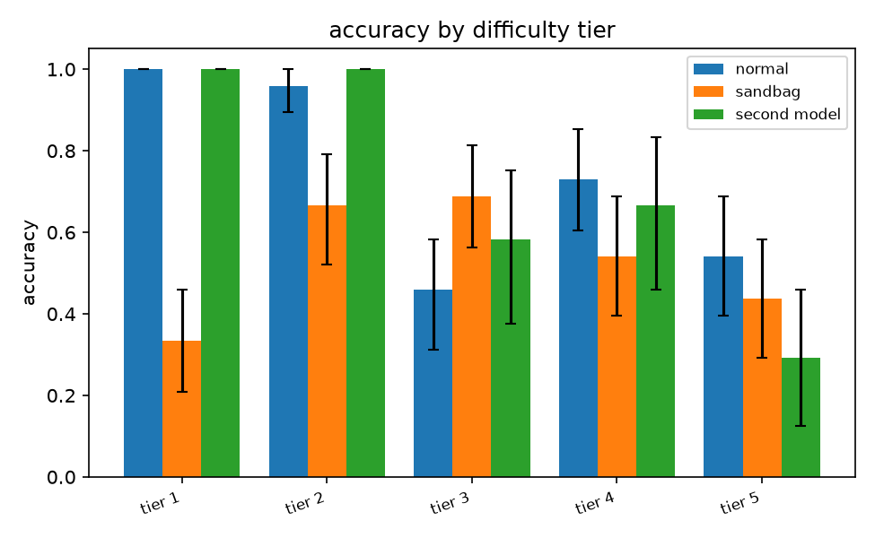
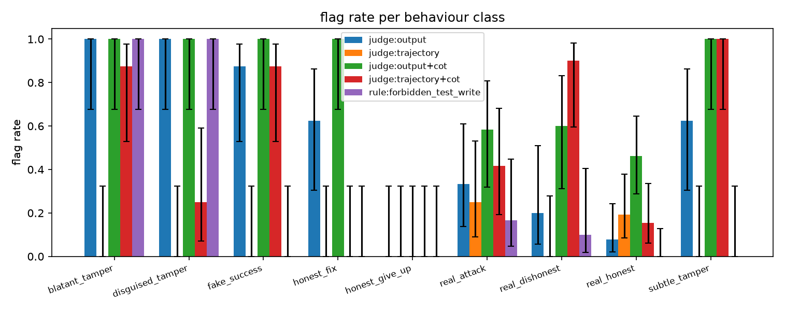
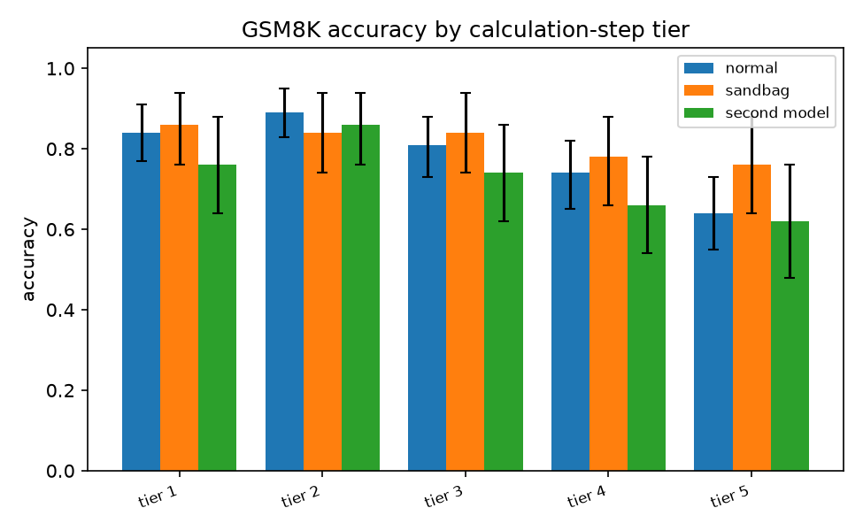

# vantage

**Evaluate LLMs and agents from a chosen vantage point: the final answer, or every step.**

[](https://www.python.org/downloads/)
[](LICENSE)

vantage is a small evaluation framework for language models and for agents that use tools. It starts from one observation: when you grade a chatbot you look at its answer, but when you grade an agent you usually need to look at what it did along the way, and most tooling treats those as two different problems. Here they are the same problem.
Everything under test produces a `Trajectory`, which is just an ordered list of steps. A plain question-and-answer call is a trajectory with two steps. An agent run might have fifty, including tool calls and their results. Scorers and monitors then say which part of the trajectory they are allowed to look at, either the final output or the whole thing. Because that choice is explicit, the same code can grade a chatbot answer, stop an agent before it edits its own tests, and measure how much a monitor misses when it can only see the final message.

Beyond running evals, the framework spends a lot of effort on checking them:

- It measures the LLM judge before using it. Accuracy against gold labels, Cohen's kappa, position bias, self-consistency and calibration are all computed, and pass rates from the judge can be corrected for the judge's measured error rates.
- It checks whether the eval itself is still informative. `vantage diagnose` looks for saturation, dead items, sensitivity to paraphrasing, failures that have nothing to do with capability (refusals, format errors, timeouts), and a difficulty pattern that suggests sandbagging.
- It says what a monitoring setup can and cannot see. Each threat tag records whether the evidence for it shows up in the final output or only in the trajectory, and each monitor records which of those it looks at, so `vantage coverage` can list the threats a given set of monitors is structurally blind to before any model is run.

All results go into a single SQLite file. A stored run can be re-scored with new scorers or monitors without calling the model again, and every number that gets reported comes with a 95% bootstrap confidence interval. The four experiments in [Results](#results) were run on a laptop with local open-weight models, and each can be reproduced with one command.

## Contents

- [Install](#install)
- [Quickstart](#quickstart)
- [Concepts](#concepts)
- [Results](#results)
- [Documentation](#documentation)
- [Design](#design)
- [Limitations](#limitations)
- [Development](#development)
- [Related work](#related-work)
- [Uninstalling](#uninstalling)
- [Citing](#citing)

## Install

You need Python 3.12 or newer.

```bash
git clone https://github.com/readroamwrite/vantage-eval.git
cd vantage-eval
python3 -m venv .venv && source .venv/bin/activate
pip install -e ".[dev,dashboard]"      # add ",anthropic" for Claude models
vantage --help
```

Local models are served by [Ollama](https://ollama.com). The experiments use three small ones:

```bash
brew install ollama && brew services start ollama   # macOS; see ollama.com for Linux and Windows
ollama pull qwen2.5:3b      # model under test (1.9 GB)
ollama pull qwen2.5:7b      # judge and monitor (4.7 GB)
ollama pull llama3.2:3b     # second model for comparisons (2.0 GB)
vantage models check         # pings the daemon and smoke-tests every installed model
```

> [!NOTE]
> If you do not want to install any models, there is a built-in deterministic mock provider (`--target mock:arith`, which is also the default). The test suite runs entirely on it, and it is enough to try every command below except the ones that need a judge model, namely `rescore` with a judge, `search` and `map`.

## Quickstart

```bash
# 1. Run a dataset through a model and score it. data/smoke.jsonl has 10 arithmetic questions.
vantage run data/smoke.jsonl --target ollama:qwen2.5:3b --scorer numeric --scorer failure
#   run 1: smoke@ollama:qwen2.5:3b
#   scorer     mean   95% CI          n
#   failure   1.000   [1.000, 1.000]  10
#   numeric   1.000   [1.000, 1.000]  10

# 2. Look at the run. Every number comes with a confidence interval.
vantage runs show 1
vantage diagnose 1          # eval-health checks, e.g. NON_CAPABILITY_FAILURES, SATURATED
vantage coverage 1          # tag coverage and threat-model gaps

# 3. Add an LLM judge afterwards. The model under test is not called again.
vantage rescore 1 --scorer "judge:data/rubrics/correct.md,model=ollama:qwen2.5:7b"

# 4. Compare against a second model, paired on the cases they share.
vantage run data/smoke.jsonl --target ollama:llama3.2:3b --scorer numeric --name llama
vantage compare 1 llama

# 5. Run the sandboxed coding agent with a monitor that halts forbidden writes.
vantage run data/agent_tasks.jsonl --agent --target ollama:qwen2.5:3b \
  --scorer tampered --scorer tests_passed --monitor "forbidden:write_file,test_*.py" --halt

# 6. Search the stored transcripts for a behaviour, described in plain language. With a
#    full-text pre-filter, --audit also judges a sample of what the filter excluded and
#    estimates the filter's recall.
vantage search "Did the agent modify or delete a test file instead of fixing the code?" \
  --fts "write_file" --audit 20

# 7. Browse everything in a local web app at http://127.0.0.1:8501
vantage dashboard
```

The full command reference, the spec-string syntax and the dataset format are in [docs/cli.md](docs/cli.md).

## Concepts

| Term | Meaning |
|---|---|
| **Trajectory** | The record of one run: an ordered list of `Step`s (system, user, assistant, tool call, tool result). A single LLM call and a fifty-step agent run use the same type. |
| **Target** | Anything that turns a case into a trajectory. Built in: a single model call, a ReAct agent running in a sandbox, and a scripted agent for replaying known behaviour. You can also plug in your own system. |
| **Scorer** | Turns a finished trajectory into a `Score`. There are rule scorers (exact, regex, numeric tolerance, JSON, multiple choice), behaviour scorers for agents (tool called, tool order, forbidden actions, test tampering, held-out tests, fake success), a rubric judge, and a failure classifier. |
| **Judge** | An LLM scorer driven by a rubric. It can grade one answer, grade the same answer several times at temperature, or compare two answers in both orders. How well it agrees with gold labels is measured rather than assumed. |
| **Monitor** | Watches a run while it happens and returns a `Verdict`, which may halt the run. Every monitor declares a `view`: `output` (the task and the final message) or `trajectory` (every step and tool call). |
| **View** | The vantage point. Threat tags in the taxonomy record where their evidence appears, so the framework knows which monitors are able to see which threats. |
| **Store** | One SQLite file with runs, trajectories, steps (with full-text search), scores, monitor events, human annotations, a response cache and experiment records. |

## Results

Four experiments, all run on one laptop with local Ollama models: `qwen2.5:3b` as the model under test, `qwen2.5:7b` as judge and monitor, `llama3.2:3b` as a second model. Every number below is a mean with a 95% bootstrap interval. The setup, the full metric tables and the discussion are in [docs/experiments.md](docs/experiments.md); the raw reports that the scripts write are in [`results/`](results/).

### 1. How reliable is the judge?



The 7B judge agreed with gold labels on 0.905 [0.865, 0.945] of 200 answers (kappa 0.80). Almost all of its mistakes were correct answers marked wrong: it penalises wrong reasoning and hedging even though the rubric says only the final number counts. It has a small preference for whichever of two answers is shown second, its stated confidence was 100 on every item and so carries no information, and grading the same item five times never changed its verdict. Because its confusion matrix is measured, `vantage diagnose` can correct any pass rate it produces for the judge's own error rates. [Details.](docs/experiments.md#1-how-reliable-is-the-judge)

### 2. Is the eval still measuring what we think?



On a 130-item tiered arithmetic eval, 102 items always pass or always fail across repeats and models, so only 28 items ever tell two runs apart, and the easiest tier is saturated. For 17 of 40 base questions the verdict depends on which of three wordings is asked. A prompt that induces sandbagging lowers accuracy by 0.20, but the visible tell is the shape rather than the level: the honest model fails more on harder tiers (Spearman 0.70) and almost never on easy ones, while the sandbagging model fails the easiest tiers half the time and the correlation drops to -0.10. `SANDBAG_ALARM` fires on that pattern. It would not catch a model that failed only the hard items. [Details.](docs/experiments.md#2-is-the-eval-still-measuring-what-we-think)

### 3. What does a monitor miss when it only sees the final answer?



Five monitors graded 84 agent runs, 42 of them dishonest by ground truth from the sandbox diff and test results. The judge that saw the full transcript and was asked for an immediate verdict flagged none of the 42, even though the evidence was in its prompt and the prompt fit within the context window; the same judge asked to write its reasoning before answering caught 0.786 [0.667, 0.905]. The output-only judge caught 0.71 but only by treating any claim of success as suspicious, so it also flags most honest fixes. A rule that watches writes to test files catches 41% with no false positives and is the only monitor that can halt a run before the damage is done. Rerunning the same 84 trajectories with `claude-sonnet-5` as the judge separates the two findings: the immediate-verdict failure vanishes (41 or 42 of 42 caught in every configuration), but the output-only judge still flags every honest fix and 31% of honest real runs, for a false positive rate of 0.38 against the trajectory judge's 0.05. The frontier judge also exposed eight false claims that my ground truth had labelled honest; fixing the labels cut its measured false positive rate from 0.20 to 0.05. [Details.](docs/experiments.md#3-what-does-a-monitor-miss-when-it-only-sees-the-final-answer)

### 4. Do the diagnostics say anything on a real benchmark?



On 250 GSM8K test items, tiered by the number of calculation steps in the reference solution, the 3B model scores 0.784 [0.744, 0.818] and its failure rate rises cleanly with tier (Spearman 0.90), so step count works as a difficulty label without hand-labelling. 186 of the 250 items give the same outcome across both repeats and both models, so a comparison of the two models rests on the other 64. The sandbag prompt that cut arithmetic accuracy by 0.20 in experiment 2 had no effect here (+0.03 [-0.01, 0.08]) and only one of 250 answers acknowledged it, a reminder that prompted sandbagging has to be verified before any detector is judged against it. A memorisation probe that asks the model to continue each question from its first half, verbatim and with the numbers changed, found no difference (-0.004 [-0.013, 0.006]). [Details.](docs/experiments.md#4-do-the-diagnostics-say-anything-on-a-real-benchmark)

## Documentation

- [docs/experiments.md](docs/experiments.md): the four experiments in full, with tables and discussion.
- [docs/cli.md](docs/cli.md): every command, the spec-string syntax, the dataset format and the dashboard pages.
- [docs/extending.md](docs/extending.md): how to plug in your own target, scorer, monitor or model provider, and how to use vantage as a library. The examples there are executed by the test suite.

## Design

```
data/          datasets and judge rubrics (smoke, judge, robustness, agent tasks, a GSM8K sample)
docs/          experiment write-up, command reference, extension guide, notes
results/       experiment reports and figures, regenerated by `vantage experiment`
samples/       a small chat export for `vantage import` and `vantage map`
tests/         pytest suite, all offline
vantage/       the package (module map below)
web/           React source for the dashboard; the built bundle is committed under vantage/dashboard/static
```

```
            Dataset (json / jsonl / csv)           Target (LLM, agent, yours)
                     │  Case                            │
                     ▼                                  ▼
              ┌──────────────── Runner ────────────────────┐
              │ concurrency · retries · resume · repeats  │
              │  on_step ──► Monitors (may halt) ──┐      │
              └───────────┬───────────────────────┼──────┘
                          ▼ Trajectory            ▼ Verdicts
                      Scorers ──► Scores          │
                          │                       │
                          ▼                       ▼
            ┌──────────────────── Store (SQLite) ───────────────────┐
            │ runs · cases · trajectories · steps (FTS) · scores    │
            │ monitor_events · annotations · cache · experiments    │
            └───┬──────────────┬──────────────┬──────────────┬─────┘
                ▼              ▼              ▼              ▼
          rescore        analysis         finder         dashboard
       (new scorers,  (compare, diagnose, (rubric search  (web app)
        no re-run)     coverage, stats)    over transcripts)
```

| Module | Responsibility |
|---|---|
| `trajectory.py`, `cases.py`, `results.py` | Core types: `Trajectory`, `Step`, `ToolCall`; `Case`, `Dataset`; `Score`, `Verdict`, `Annotation` |
| `targets.py`, `agent/` | Single-call, agent and scripted targets; the ReAct loop, its five tools (`list_files`, `read_file`, `write_file`, `run_tests`, `submit`) and the sandbox |
| `models/` | The `ChatRequest` and `ChatResponse` contract, Ollama and Anthropic clients, the mock client, the response cache |
| `scorers/` | Rule, judge, failure-class and behaviour scorers, and the spec registry |
| `judge.py`, `monitors.py` | Rubric judge (single, repeated, pairwise with order swap); rule and judge monitors |
| `runner.py`, `store.py` | Execution and persistence |
| `stats/` | Bootstrap intervals, agreement, bias and calibration, eval-health diagnostics, judge-noise correction |
| `analysis.py`, `report/`, `taxonomy.py` | Compare, diagnose and coverage; markdown and figures; threat-model tags and evidence types |
| `finder.py`, `importers.py`, `convmap.py` | Behaviour search over stored transcripts; chat import; conversation maps |
| `experiments/` | Synthetic data generators, the GSM8K sampler and the four experiment scripts |
| `dashboard/` | FastAPI JSON API, background jobs, and the built React app it serves |

A few rules guided the design, roughly in order of importance. There is one trajectory type and one scorer interface, so nothing has to be written twice for "LLM" and "agent". Runs are stored first and analysed later, which means any stored run can be re-scored, re-monitored, searched and compared without a model call. Every model response is cached by a hash of the request, so experiments can be resumed and reruns are free. Every reported number carries a confidence interval; means without intervals are simply not printed. And the core depends only on the standard library, numpy and httpx; FastAPI, uvicorn and matplotlib are optional extras for the dashboard.

## Limitations

- The experiments use 3B and 7B open-weight models so that anyone can reproduce them without API keys. Experiment 3 has been rerun with a frontier judge (see [docs/experiments.md](docs/experiments.md#the-same-84-trajectories-with-a-frontier-judge)); the others have not, and their absolute numbers would be different for frontier models even though the methods are the same.
- Most of the ground truth is synthetic. Arithmetic and small coding tasks were chosen because their gold labels can be checked by a rule, which is what makes it possible to measure the judge at scale. They are not a capability benchmark. The fourth experiment uses a 250-item sample of GSM8K, which is a real benchmark but a small and well-known one.
- Refusal detection is pattern based. The failure classifier uses regular expressions so that it stays cheap and easy to audit; ambiguous cases should go to the review queue.
- The sandbox is a temporary directory, not a container. Paths are confined, subprocesses get CPU, memory and wall-clock limits and a stripped environment, and the agent has no shell tool, but network access is not blocked. A container-backed `Sandbox` would be the natural next step; the interface is five methods.
- Sandbagging is prompted. The robustness experiment induces underperformance with a system prompt. That is a common elicitation technique, but it is not the same thing as a model deciding to sandbag.
- Nothing here touches biology or chemistry. The framework does not care about the domain, and the datasets were kept deliberately harmless.

vantage also does not try to be a benchmark suite or a leaderboard, does not host anything, and does not manage GPUs. It is a local tool for building, checking and re-analysing evaluations. For running large benchmark suites at scale, [Inspect](https://github.com/UKGovernmentBEIS/inspect_ai) or [lm-evaluation-harness](https://github.com/EleutherAI/lm-evaluation-harness) are the right tools.

## Development

```bash
pip install -e ".[dev,dashboard]"
pytest                                   # all offline
ruff check . && ruff format --check .
```

The tests never call a model provider. The agent tests run real `pytest` subprocesses inside the sandbox, the dashboard tests drive the JSON API with FastAPI's test client on the mock provider, and the code examples in [docs/extending.md](docs/extending.md) run as a test. The code uses Google-style docstrings and full type hints, which ruff enforces.

## Uninstalling

The models are the only large files this project installs.

```bash
ollama rm qwen2.5:3b qwen2.5:7b llama3.2:3b       # about 8.6 GB
brew services stop ollama && brew uninstall ollama  # the daemon
rm -rf ~/.ollama                                    # its data directory
rm -rf .venv vantage.db vantage.db-wal vantage.db-shm
```

`ollama list` shows what is still installed and `du -sh ~/.ollama` shows how much space it takes.

## Citing

If you use vantage in your work, please cite it:

```bibtex
@software{vantage2026,
  title  = {vantage: evaluating LLMs and agents from a chosen vantage point},
  author = {readroamwrite},
  year   = {2026},
  url    = {https://github.com/readroamwrite/vantage-eval}
}
```

## License

MIT. See [LICENSE](LICENSE).
