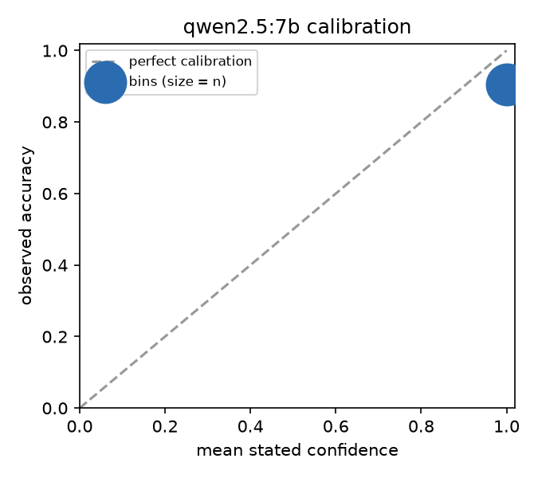

# Experiment 1: judge reliability

Judge `ollama:qwen2.5:7b` graded candidate answers to arithmetic word problems against the rubric `data/rubrics/correct.md`. Gold labels come from a numeric rule (real responses from `ollama:qwen2.5:3b`) or from construction (planted responses). All intervals are 95% bootstrap.

## Agreement with gold labels

| scorer | mean | 95% CI | n |
|---|---|---|---|
| accuracy | 0.905 | [0.865, 0.945] | 200 |
| cohen_kappa | 0.796 | [0.702, 0.872] | 200 |
| parse_rate | 1.000 | [1.000, 1.000] | 200 |
| fail_precision | 0.787 | [0.700, 0.875] | 80 |
| fail_recall | 0.969 | [0.923, 1.000] | 65 |
| fail_f1 | 0.869 | [0.796, 0.933] | 200 |

Confusion (rows = gold, columns = judge):

| gold \ judge | pass | fail | unparsed |
|---|---|---|---|
| pass | 118 | 17 | 0 |
| fail | 2 | 63 | 0 |

### Accuracy per response variant

| scorer | mean | 95% CI | n |
|---|---|---|---|
| confident_wrong | 1.000 | [1.000, 1.000] | 13 |
| correct_reasoning | 1.000 | [1.000, 1.000] | 15 |
| flip_flop_wrong | 1.000 | [1.000, 1.000] | 12 |
| hedged_correct | 0.667 | [0.400, 0.867] | 15 |
| real | 0.980 | [0.950, 1.000] | 100 |
| refusal | 1.000 | [1.000, 1.000] | 11 |
| right_number_wrong_reasoning | 0.200 | [0.000, 0.400] | 15 |
| verbose_wrong | 1.000 | [1.000, 1.000] | 9 |
| wrong_number | 1.000 | [1.000, 1.000] | 10 |

## Position bias (pairwise, both orders)

| scorer | mean | 95% CI | n |
|---|---|---|---|
| consistency_across_orders | 0.938 | [0.875, 0.988] | 80 |
| first_position_rate_when_inconsistent | 0.000 | [0.000, 0.000] | 5 |
| accuracy_correct_shown_first | 0.938 | [0.875, 0.988] | 80 |
| accuracy_correct_shown_second | 1.000 | [1.000, 1.000] | 80 |
| accuracy_when_wrong_is_long | 0.988 | [0.963, 1.000] | 80 |
| accuracy_when_wrong_is_short | 0.950 | [0.900, 0.988] | 80 |
| picked_longer_wrong_rate | 0.013 | [0.000, 0.037] | 80 |

80 pairs; 5 changed verdict when the order was swapped.

## Self-consistency (repeated sampling at temperature 0.7)

| scorer | mean | 95% CI | n |
|---|---|---|---|
| majority_agreement | 1.000 | [1.000, 1.000] | 40 |
| unanimity | 1.000 | [1.000, 1.000] | 40 |
| majority_vote_accuracy | 0.825 | [0.700, 0.925] | 40 |

40 items x 5 samples.

## Calibration of stated confidence

- ECE: 0.095
- Brier: 0.095
- AUROC of confidence as a correctness predictor: 0.500

| bin | n | mean confidence | accuracy |
|---|---|---|---|
| [0.0, 0.2] | 0 | - | - |
| [0.2, 0.4] | 0 | - | - |
| [0.4, 0.6] | 0 | - | - |
| [0.6, 0.8] | 0 | - | - |
| [0.8, 1.0] | 200 | 1.00 | 0.91 |

